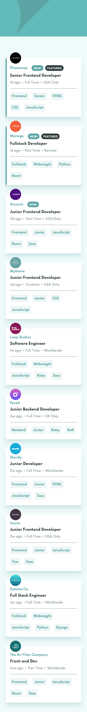
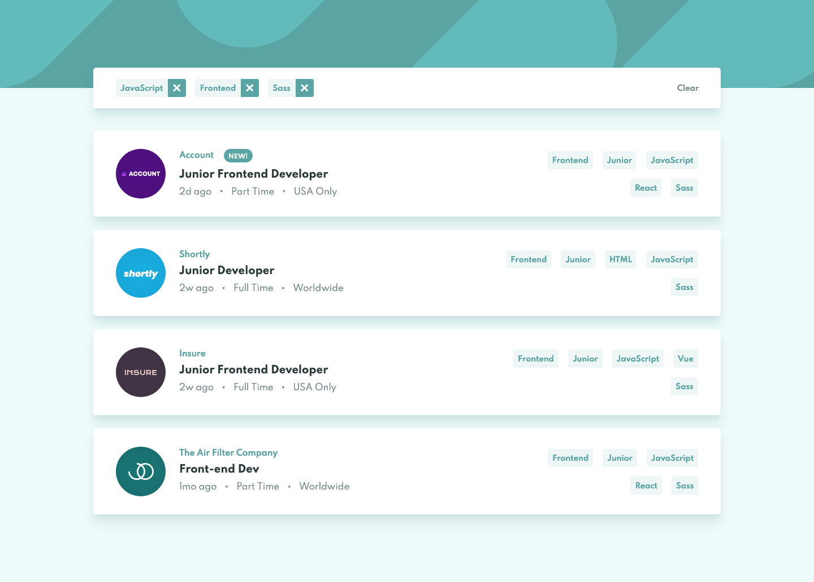

# Frontend Mentor - Job Listings with Filtering Solution

This is a solution to the [Job Listings with Filtering Challenge on Frontend Mentor](https://www.frontendmentor.io/challenges/job-listings-with-filtering-ivstIPCt). Frontend Mentor challenges help you improve your coding skills by building realistic projects. 

## The challenge

Users should be able to:

- View the optimal layout for the site depending on their device's screen size
- See hover states for all interactive elements on the page
- Filter job listings based on the categories

## Screenshot

### Mobile


### Desktop


## Built with

- Semantic HTML5 markup
- CSS custom properties
- Flexbox
- Mobile-first workflow
- JavaScript
- jQuery

## What I learned

I reminded myself how to fetch data from an external json file. In this project I used the json data to generate the Job Listings on page load. A particular difficulty was turning the 'role', 'level', 'languages' and 'tools' into category buttons. I did this by making them into an array...

```js
const categoriesArray = [job.role, job.level, ...job.languages, ...job.tools];
```

...and then looping through each item of the array to create the HTML text which is stored in the `categoriesHTMLString` variable:

```js
const categoriesArray = [job.role, job.level, ...job.languages, ...job.tools];
    let categoriesHTMLString = '';
    for (const category of categoriesArray) {
        const categoryHTMLString = `<button class="job__category" type="button">${category}</button>`;
        categoriesHTMLString += categoryHTMLString;
    }
```

Another conundrum I faced was filtering out the jobs based on the categories selected. My solution was to create an array out of the filtered categories...

```js
const filteredCategoryArray = [...FILTERED_CATEGORIES_CONTAINER[0].children].map(category => category.innerText.replace(/[^a-z]/gi, ''));
```

...and then loop through each job to create an array out of the job categories. Then check if the job categories contain all the filtered categories - if not, then the job is removed from the list.

I made this project difficult for myself by including lots of animations. I had to iron out some bugs that occured if you tried to spam the animations.

I also used more custom properties than usual. I usually apply them for colors, font-weights and border radii, but in this project I decided to use them for dimensions and spacing (like `width`, `height` and `padding`). This is something I will continue to do in future projects.

## Continued development

I really enjoyed applying the animations in this project and I will continue to experiment. I want to practice more algorithmic JavaScript (perhaps get back into Code Wars) as my DOM manipulation knowledge has really improved recently. I've not used SASS for a while so I will probably pick another FEM project to practice it. And I want to learn React or Vue soon but not quite sure how to approach them.